<div align="center">
<!--  -->

<h1>🤖 ABot-PhysWorld</h1>


<p align="center">
  <b>AMAP CV Lab</b>
</p>


<p align="center">
  <a href="https://github.com/amap-cvlab/ABot-PhysWorld"></a>
  <a href="https://github.com/amap-cvlab/ABot-PhysWorld/"></a>
    <a href="https://huggingface.co/acvlab"></a>
</p>

</div>


> **ABot-PhysWorld** is a physically consistent, action-controllable video world model for robotic manipulation, built on a 14-billion-parameter Diffusion Transformer. It integrates physics-aware training, memory-efficient preference optimization, and precise spatial action injection to generate realistic and physically plausible robot-object interactions — even in zero-shot settings.


## Table of Contents
- [📚 Key Contributions](#-key-contributions)
- [🚀 EZS-Bench](#-ezs-bench)
- [📊 Evaluation](#-Evaluation)
- [🖼️ Qualitative Results](#️-qualitative-results)
- [🛠️ Usage](#️-usage)
- [📜 Citing](#-Citing)
- [🙏 Acknowledgement](#-acknowledgement)


## 📚 Key Contributions

1. **Industrial-Grade Data Pipeline**  
   Curated ~3M real-world manipulation clips from five datasets (`AgiBot`, `RoboCoin`, `RoboMind`, `Galaxea`, `OXE`) with motion, semantic, and action consistency filtering, plus hierarchical sampling for balanced generalization.
   
   <div align="center">
    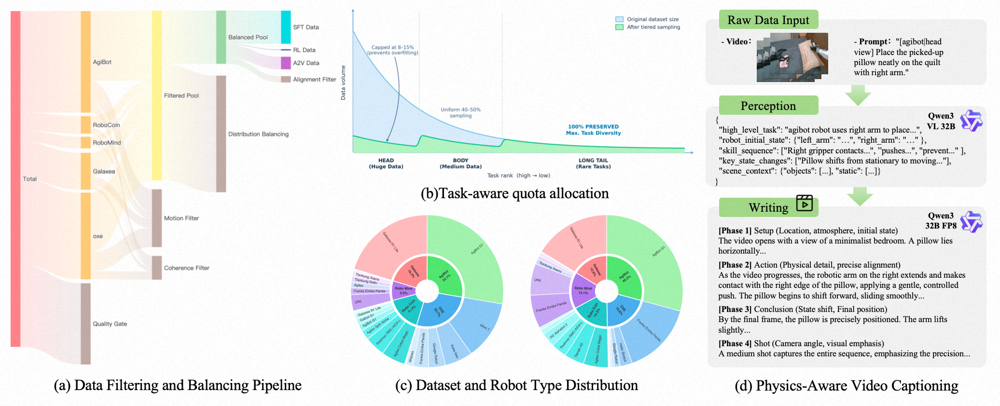
   </div> 

2. **Physics-Aware DPO Training**  
   Introduces a decoupled VLM-based discriminator: Qwen3-VL generates task-specific physics checklists, Gemini 3 Pro scores videos via Chain-of-Thought; combined with LoRA-augmented DPO on a 14B DiT to enforce physical plausibility.
      
   <div align="center">
    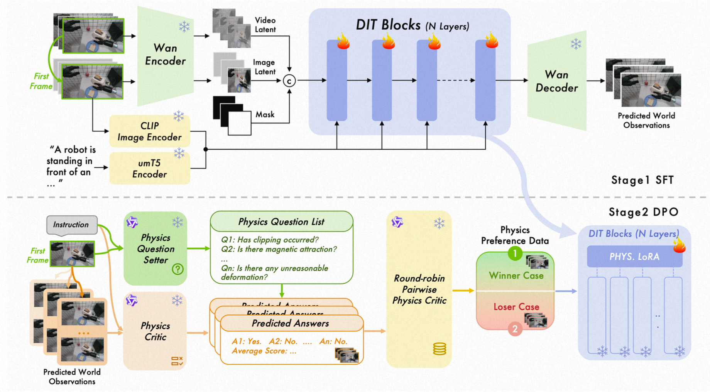
   </div> 

3. **Parallel Context Blocks for Action Control**  
   Enables precise action-conditioned generation by residually injecting spatial action maps into cloned DiT blocks, preserving physical priors while supporting cross-embodiment control.

   <div align="center">
    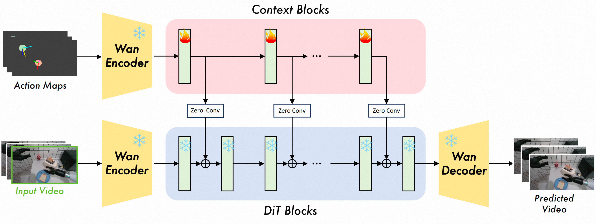
   </div> 

4. **EZSbench – First True Zero-Shot Benchmark**  
   Fully training-independent evaluation covering unseen robot, scene, and task combinations, with dual-model scoring to eliminate self-evaluation bias.

   <div align="center">
    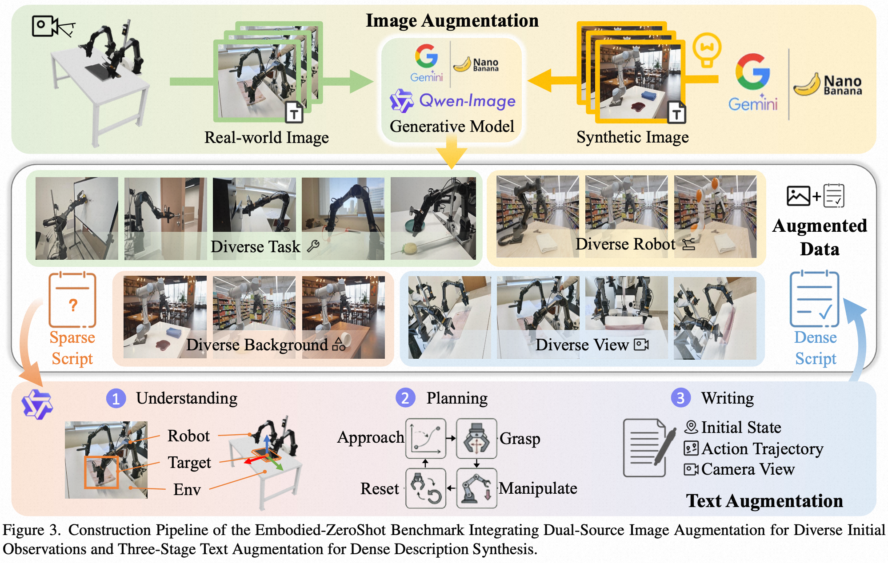
   </div> 


---

## 🚀 EZS-Bench

**Embodied-ZeroShot Benchmark for Physically Consistent Video Generation** 🤖✨


EZS-Bench is a zero-shot evaluation benchmark designed to rigorously assess **physically plausible video generation** in robotic manipulation. It evaluates models on **physical consistency**, **action controllability**, and **cross-embodiment generalization**—with *no training-test data overlap*. 🔍🔬

### ✨ Key Features

✅ **True Zero-Shot Evaluation**  
Unseen combinations of:  
- 🤖 Robot morphologies (e.g., single-arm, bimanual, custom kinematics)  
- 🌍 Scenes & backgrounds  
- 🎯 Manipulation tasks (pick-and-place, wiping, assembly, etc.)

🎨 **Dual-Source Data Construction**  
- 🧬 *Synthetic branch*: Text-to-image generation with controlled variation  
- 🖼️ *Real-world editing*: VLM-driven scene augmentation preserving physical interactions

🧠 **Physics-Aware Evaluation**  
- Dynamic physical checklists generated by VLMs (e.g., *"Does the gripper penetrate the object?"*, *"Is gravity respected?"*)  
- 30–50% negative questions to prevent guessing 🚫  
- Decoupled scorer architecture to eliminate self-evaluation bias ⚖️

📊 **Comprehensive Metrics**  
Evaluates:  
- Physical fidelity (penetration, contact, deformation) 💥  
- Temporal coherence 🕒  
- Spatial alignment & trajectory consistency 🎯  


###  📢 Coming Soon
The full EZS-Bench dataset and evaluation toolkit will be **publicly released** to advance research in embodied AI and world modeling. Stay tuned! 🔔

🔗 *For more details, see the ABot-PhysWorld technical report.*


---

## 📊 Evaluation

We evaluate ABot-PhysWorld on three key aspects:  
- **Physical Consistency** (via **PBench** and **EZSbench**)  
- **Zero-Shot Generalization** (via **EZSbench**)  
- **Action-Conditioned Controllability** (via custom A2V benchmark)

### 📈 Summary of Advancements 🎉🎉

| Capability | Benchmark | Ours | Best Baseline | Gain |
|----------|-----------|------|---------------|------|
| Physical Fidelity | PBench (Domain Score) | **0.9306** | 0.8644  (Wan2.5) | +6.62% |
| Zero-Shot Generalization | EZSbench (Domain Score) | **0.8366** | 0.7951 (WoW) | +4.15% |
| Action Control | Trajectory Consistency | **0.8522** | 0.8157 (Enerverse) | +3.65% |

✅ ABot-PhysWorld establishes a new standard for **physically grounded**, **controllable**, and **generalizable** world models in robotic manipulation.

---

## 🖼️ Qualitative Results

Selected representative zero-shot generation results demonstrating ABot-PhysWorld's strong generalization and physical plausibility.


### 🎯 Zero-Shot Capabilities

#### 🔧 Scene 1: Deformable Object – Dual-Arm Towel Folding  
<div align="center">
  <table>
    <tr>
      <td>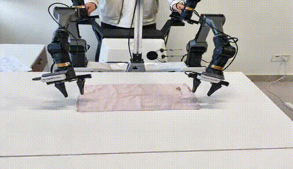</td>
      <td>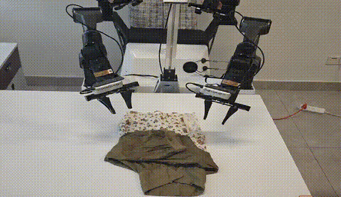</td>
    </tr>
    <tr>
      <td>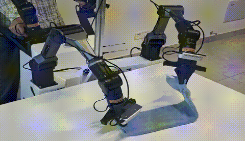</td>
      <td>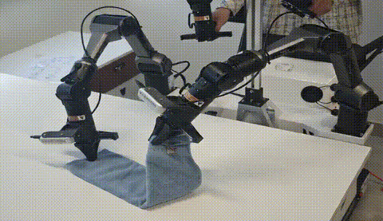</td>
    </tr>
  </table>
</div>

- **Task**: Fold a towel using dual robotic arms  
- **Challenge**: Complex cloth dynamics and bimanual coordination  
- **Ours**:  
  ✅ Physically realistic deformation  
  ✅ Smooth, collision-free arm motion  
  ✅ Natural folding sequence with consistent contact


#### 🥤 Scene 2: Fine Manipulation – Diverse Object Handling  
<div align="center">
  <table>
    <tr>
      <td>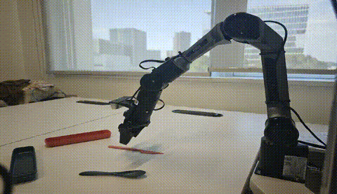</td>
      <td>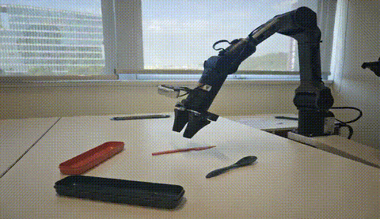</td>
    </tr>
    <tr>
      <td>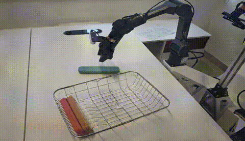</td>
      <td>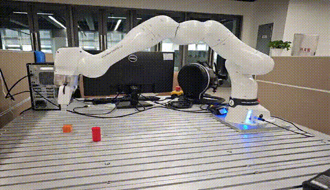</td>
    </tr>
    <tr>
      <td>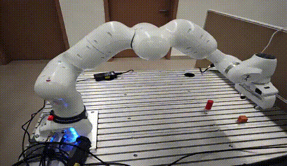</td>
      <td>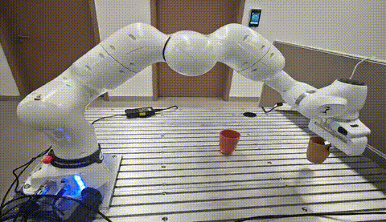</td>
    </tr>
    <tr>
      <td>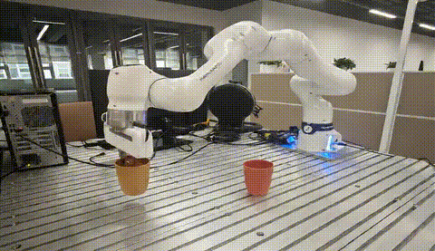</td>
      <td>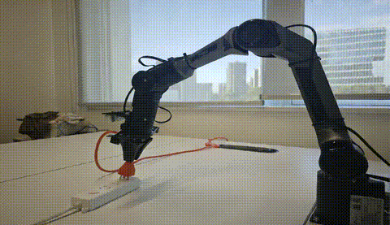</td>
    </tr>
  </table>
</div>

- **Task**: Stack cups, build blocks, place a knife  
- **Challenge**: Varying shapes, weights, and friction  
- **Ours**:  
  ✅ Accurate grasp pose prediction  
  ✅ Adaptive gripper control  
  ✅ Stable pick-and-place without slippage or penetration


#### 🚪 Scene 3: Articulated Object – Opening a Cabinet Door  
<div align="center">
  <table>
    <tr>
      <td>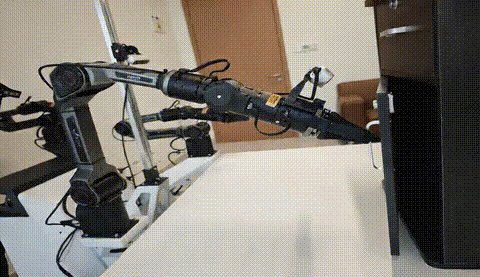</td>
      <td>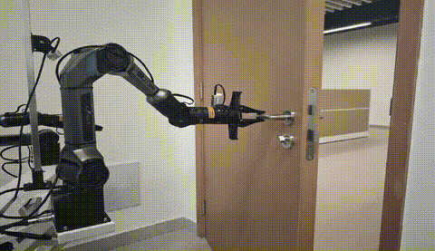</td>
    </tr>
  </table>
</div>

- **Task**: Open a hinged cabinet or door  
- **Challenge**: Enforce rotational constraints and correct force direction  
- **Ours**:  
  ✅ Proper handle grasping  
  ✅ Realistic hinge rotation  
  ✅ Motion follows physical pivot axis


#### 🫗 Scene 4: Fluid Interaction – Pouring Water  
<div align="center">
  <table>
    <tr>
      <td>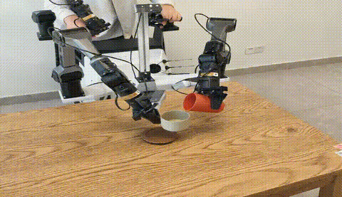</td>
      <td>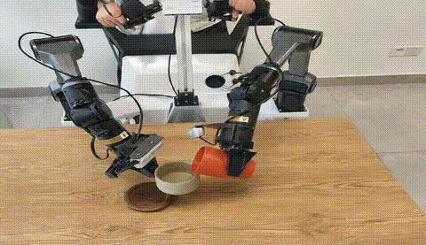</td>
    </tr>
  </table>
</div>

- **Task**: Pour water from a cup into a bowl using dual arms  
- **Challenge**: Bimanual coordination, tilt control, liquid dynamics  
- **Ours**:  
  ✅ Collision-free trajectory planning  
  ✅ Accurate pour timing and angle  
  ✅ Visual consistency in fluid transfer (simulated proxy)


#### 🧽 Scene 5: Cleaning Task – Wiping a Stain  
<div align="center">
  <table>
    <tr>
      <td>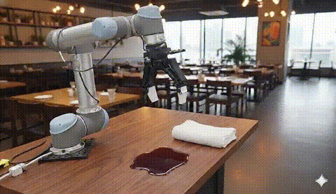</td>
      <td>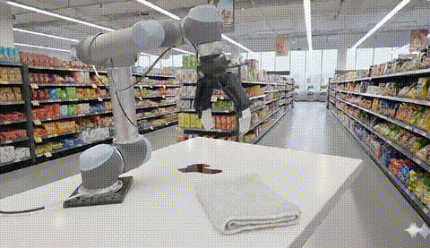</td>
    </tr>
    <tr>
      <td>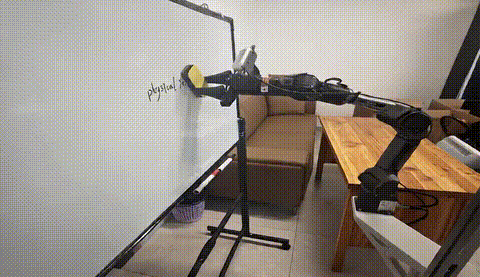</td>
      <td>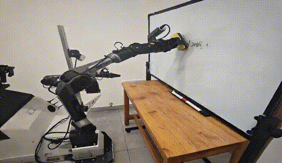</td>
    </tr>
  </table>
</div>

- **Task**: Wipe a stain off a table  
- **Challenge**: Maintain contact, uniform pressure, full coverage  
- **Ours**:  
  ✅ Continuous tool-surface contact  
  ✅ Systematic wiping motion  
  ✅ Gradual removal of the stain in video output


#### 🍓 Scene 6: Multi-Scene Generalization – Fruit Sorting  
<div align="center">
  <table>
    <tr>
      <td>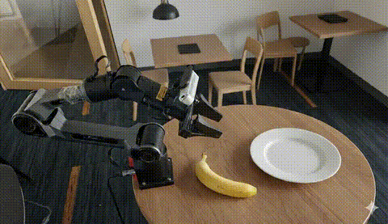</td>
      <td>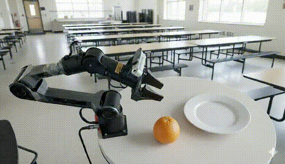</td>
    </tr>
    <tr>
      <td>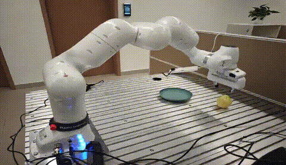</td>
      <td>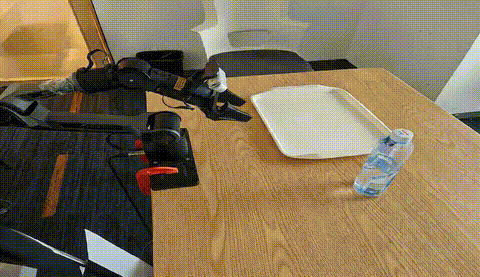</td>
    </tr>
  </table>
</div>

- **Task**: Place fruits into a plate across diverse scenes  
- **Challenge**: Background, lighting, and fruit variation  
- **Ours**:  
  ✅ Robust object recognition under domain shifts  
  ✅ Consistent performance across unseen environments  
  ✅ Fast and stable manipulation regardless of setup


### 🔍 Pbench Results Demonstration

We conducted systematic qualitative comparative experiments on the **PAI-Bench**  benchmark dataset. Below are the generated results from several typical scenarios.

<div align="center">
  <table>
    <tr>
      <td>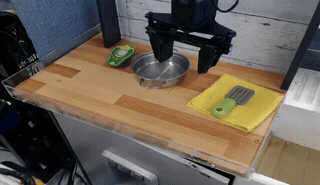</td>
      <td>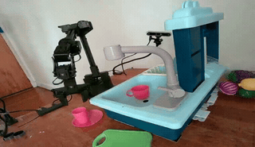</td>
    </tr>
    <tr>
      <td>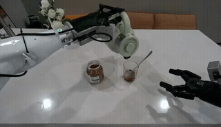</td>
      <td>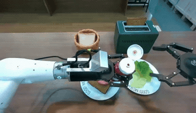</td>
    </tr>
    <tr>
      <td>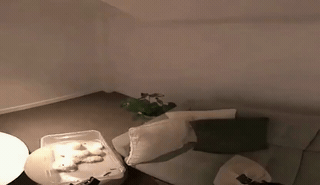</td>
      <td>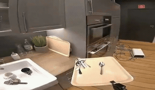</td>
    </tr>
  </table>
</div>

| Task | Baselines | **Ours** |
|------|-----------------------------|--------|
| Grasping | Frequent penetration, floatation | ✅ Firm contact, no violation |
| Long-horizon Planning | Inconsistent state transitions | ✅ Coherent multi-step reasoning |
| Rigid-body Dynamics | Unphysical deformations | ✅ Preserved geometry and mass behavior |
| Contact Modeling | Non-contact attraction | ✅ Realistic interaction onset |

> Our model consistently generates physically valid trajectories even in complex, unseen scenarios — proving its utility as a reliable simulator for embodied AI.


---


## 🛠️ Usage

> _Coming soon: Public release of model weights, inference code, and EZSbench toolkit._


---


## 📜 Citing

If you find **ABot-PhysWorld** is useful in your research or applications, please consider giving us a **star** 🌟 and **citing** it by the following BibTeX entry:

```
@article{
  title={ABot-PhysWorld: Interactive World Foundation Model for Robotic Manipulation with Physics Alignment},
  year={2026}
}
```

---


## 🙏 Acknowledgement
This project builds upon [Wan2.1](https://github.com/Wan-Video/Wan2.1), [VACE](https://github.com/ali-vilab/VACE), [DiffSynth-Studio](https://github.com/modelscope/DiffSynth-Studio). We thank these teams for their open-source contributions.

---


